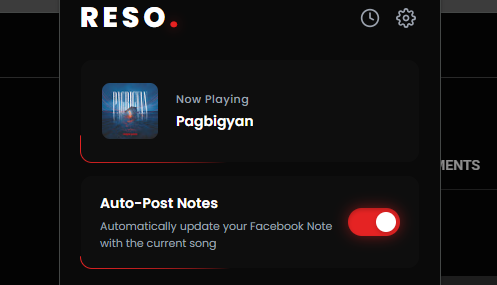

<div align="center">

# RESO

Seamless real-time music presence for your Facebook Notes, powered by TypeScript and YouTube Music.

[](https://www.typescriptlang.org/)
&nbsp;
[](https://developer.chrome.com/docs/extensions/)
&nbsp;
[](LICENSE)

<br/><br/>



</div>

---

## Overview

**RESO** bridges your active audio playback on YouTube Music directly with Facebook Notes. Traditional social profiles often require manual status updates or heavy desktop clients; RESO works quietly inside your browser to extract current playback state and sync rich music statuses directly to your active Facebook account via internal Relay Modern GraphQL APIs.

> [!] **Note:** RESO runs with strict browser isolation, observing YouTube Music DOM changes and routing updates only when active playback changes occur.

> [!] **Important:** You must be signed into your Facebook account in an open browser tab so RESO can securely execute GraphQL note updates within the authenticated page context.

---

## Highlights

| Feature | Description |
| :--- | :--- |
| **Real-Time Track Sync** | Automatically updates your Facebook Note when new tracks begin or pause on YouTube Music. |
| **Active Hours Window** | Configure a strict daily operating interval (including overnight windows) to prevent late-night updates. |
| **Dynamic Ambient Glow** | Automatically extracts the dominant color from track album artwork via an offscreen canvas and applies an ambient radial blur. |
| **Privacy Audience Control** | Easily toggle note visibility between **Friends** and **Public** directly from the extension dashboard. |
| **Update History Audit** | Tracks recent sync transactions in local storage with visual indicators for successful posts and errors. |
| **End-to-End TypeScript** | Strongly typed architecture covering service worker message passing, Chrome storage schema, and GraphQL payloads. |

---

## Installation

### Prerequisites

- [Node.js](https://nodejs.org/) (version 18.0.0 or higher)
- [npm](https://www.npmjs.com/) (version 9.0.0 or higher)
- A modern Chromium-based web browser (Google Chrome, Brave, Microsoft Edge, Arc)

### Step-by-Step Setup

1. **Clone the repository:**
   ```bash
   git clone https://github.com/Chrixtia/reso.git
   cd reso
   ```

2. **Install project dependencies:**
   ```bash
   npm install
   ```

3. **Compile TypeScript source code:**
   ```bash
   npm run build
   ```

4. **Load the extension in Chromium:**
   - Navigate to `chrome://extensions` in your browser.
   - Enable **Developer mode** using the toggle in the top-right corner.
   - Click **Load unpacked**.
   - Select the root folder of this project (`reso`).
   - The RESO extension icon will now appear in your browser toolbar.

> [!] **Tip:** Pin the RESO extension icon to your browser toolbar for instant access to the player dashboard, settings modal, and update history.

---

## Quick Start

### Development Mode

Run the TypeScript compiler in watch mode to automatically recompile source files when changes are saved:

```bash
npm run watch
```

### Production Build

Compile all TypeScript sources from `src/` to distribution-ready ECMAScript in `js/`:

```bash
npm run build
```

---

## Configuration Reference

<details>
<summary><b>Click to expand config options</b></summary>

<br/>

The extension preferences are persisted in `chrome.storage.local`. The table below outlines the configurable keys, types, defaults, and descriptions:

| Key | Type | Default | Description |
| :--- | :--- | :--- | :--- |
| `automationEnabled` | `boolean` | `true` | Master switch controlling whether playback changes trigger Facebook Note mutations. |
| `startTime` | `string` | `"08:00"` | Daily start boundary (`HH:MM` 24h format) for automation activity. |
| `endTime` | `string` | `"22:00"` | Daily end boundary (`HH:MM` 24h format) for automation activity. Supports overnight ranges. |
| `audienceSetting` | `string` | `"FRIENDS"` | Audience visibility for newly posted notes (`"FRIENDS"` or `"PUBLIC"`). |
| `ambienceEnabled` | `boolean` | `false` | Whether the player card dynamically tints with the album art's dominant hue. |
| `customFriendIds` | `string[]` | `[]` | Array of Facebook user IDs targeted when using custom audience configurations. |
| `lastSentSong` | `object \| null` | `null` | Cached representation of the most recently broadcasted track metadata. |
| `history` | `object[]` | `[]` | Capped queue of the 20 most recent update transactions and status results. |

</details>

---

## Automated Tests

RESO includes an automated test suite verifying time calculation algorithms, diacritic stripping, and title sanitization utilities.

Run the test suite using Node.js's built-in test runner:

```bash
npm test
```

Perform static type checking across the entire TypeScript codebase without emitting files:

```bash
npm run typecheck
```

---

## Architecture

```
reso/
├── .gitignore
├── manifest.json
├── package.json
├── README.md
├── tsconfig.json
├── assets/
│   ├── popup-BGRVEGx9.css
│   └── preview.png
├── css/
│   └── popup.css
├── html/
│   ├── options.html
│   └── popup.html
├── icons/
│   ├── icon16.png
│   ├── icon48.png
│   └── icon128.png
├── src/
│   ├── types/
│   │   ├── global.d.ts
│   │   └── index.ts
│   ├── utils/
│   │   └── time.ts
│   ├── background.ts
│   ├── content.ts
│   ├── music-provider.ts
│   ├── options.ts
│   ├── popup.ts
│   ├── youtube-music-provider.ts
│   └── tests/
│       └── utils.test.ts
└── js/
    ├── background.js
    ├── content.js
    ├── music-provider.js
    ├── options.js
    ├── popup.js
    ├── youtube-music-provider.js
    ├── utils/
    │   └── time.js
    └── tests/
        └── utils.test.js
```

---

<div align="center">

[](https://github.com/Chrixtia)
&nbsp;
[](https://discord.com/users/1443584667235389623)
&nbsp;
[](mailto:christian.pangan.viente@gmail.com)

</div>

---

## License

This project is licensed under the [MIT License](LICENSE).
